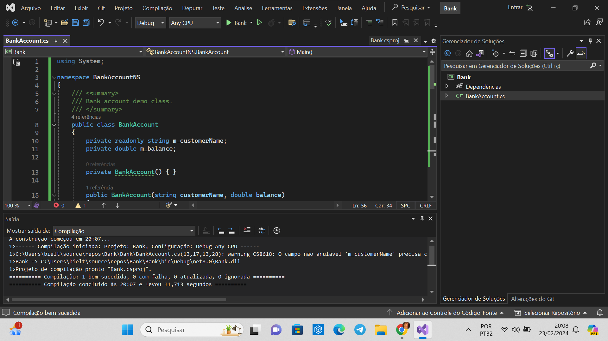
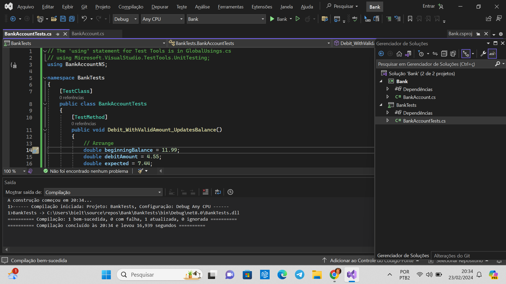
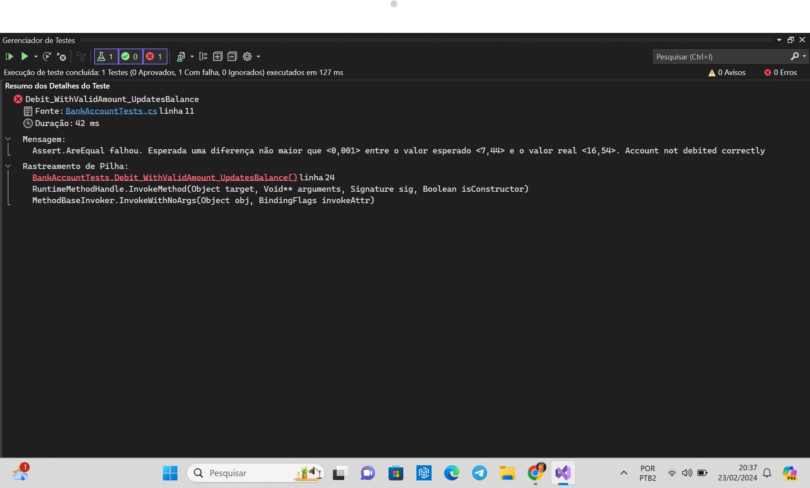
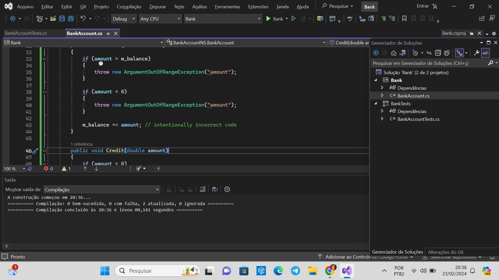
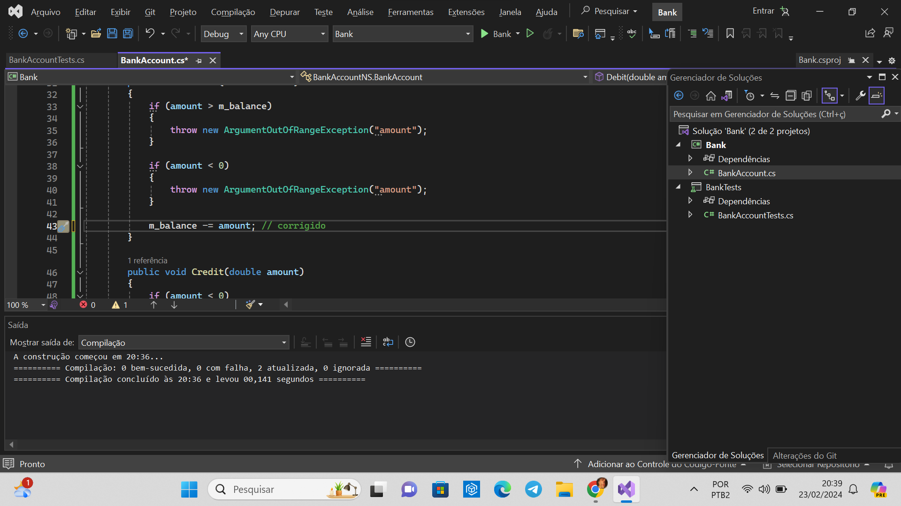
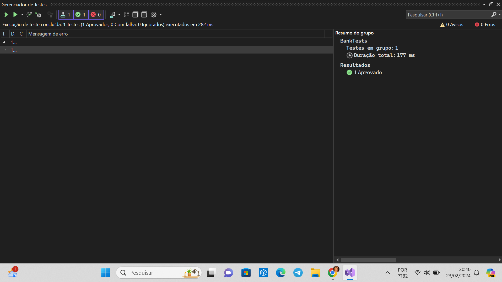
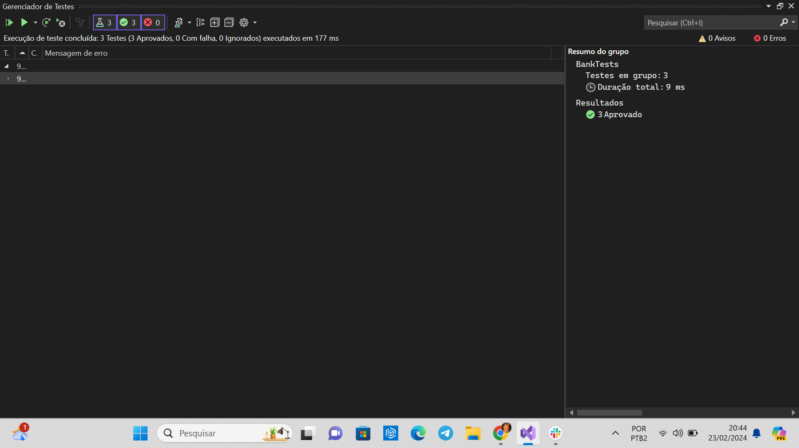

# Relatório sobre a ponderada da semana 3 sobre Testes de Unidade em C# usando o Visual Studio

## Introdução
Este relatório destina-se a fornecer uma visão geral do processo de criação e execução de testes de unidade para código gerenciado em C# usando a estrutura de teste de unidade da Microsoft e o Gerenciador de Testes do Visual Studio. O artigo abordado fornece um guia passo a passo desde a configuração do ambiente até a criação de casos de teste e a execução dos mesmos.

## Resolução da ponderada com ScreenShots

### 1. Criação do projeto Bank
Primeiro, após criar o projeto Bank, criei o arquivo BankAccount.cs, ele é compilado normalmente.


### 2. Criação do BankTests
Após isso, criei um novo projeto chamado BankTests e adicionei a referência ao projeto Bank. Ele também compila normalmente.


### 3. Execução do teste
Quando executado o teste pela primeira vez, ele falha. No texto, ele fala onde está o erro.



### 4. Identificação do erro
Analisando o teste, é possível verificar que ele falha devido a linha de código 
```csharp
m_balance += amount; // intentionally incorrect code
```


Corrigindo:


Rodando novamente:


### 5. Adição de novos testes
Depois, foi adicionado novos testes, sendo eles:
```csharp
Debit_WhenAmountIsLessThanZero_ShouldThrowArgumentOutOfRange()
``` 
e
```csharp
Debit_WhenAmountIsMoreThanBalance_ShouldThrowArgumentOutOfRange()
``` 
Executando os testes, todos passam!



### 6. Refatoração
Para a criação de testes mais robustos e que realmente são assertivos, o tutorial refatorou o código, tanto do projeto principal quanto no de teste.

Rodando os testes, eles passam normalmente.


## Tecnologia e Conceitos Aprendidos
Durante o tutorial aprendi diversas coisas:

Criação de Projeto para Teste usando o Visual Studio: Com as orientações detalhadas sobre como configurar um projeto no Visual Studio para iniciar a criação de testes de unidade, criei meu primeiro projeto usando o aplicativo.

Criação de Projeto de Teste de Unidade (BankTests): Além do teste principal, para motivos de organização e padronização, foi criado um projeto de teste de unidade separado, onde adicionei referências ao projeto principal.

Criação da Classe de Teste: Para fazer os testes, usei programação orientada a objetos (POO), criei uma classe de teste para a classe principal que está sendo testada.

Execução de Testes: Aprendi a como executar testes no Visual Studio e como ver de forma detalhada o motivo do teste ter falhado.

Refatoração de Testes e Código: Durante o tutorial, fiz algumas refatorações no código, lá fala sobre a importância da melhoria contínua dos testes e do código, demonstrando como refatorar os testes para torná-los mais robustos e informativos.

## Considerações Finais
O processo detalhado no artigo destaca a importância dos testes de unidade na garantia da qualidade do software, bem como na melhoria contínua do código. Através da utilização de ferramentas como o Visual Studio e a estrutura de teste de unidade da Microsoft, os desenvolvedores são capacitados a criar testes eficazes que podem identificar falhas no código e fornecer feedback rápido durante o ciclo de desenvolvimento.

Além disso, a abordagem iterativa sugerida, envolvendo análise, desenvolvimento e refatoração de testes e código, promove a construção de software mais confiável e de alta qualidade.

Em resumo, a prática de testes de unidade, conforme descrito no artigo, é uma parte essencial do desenvolvimento de software que contribui significativamente para a entrega de produtos sólidos e confiáveis aos usuários finais.